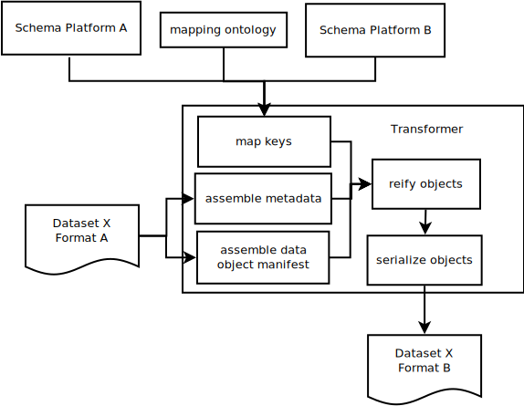

# Metadata Serialization

This document offers ways for platforms that are part of the NIH Data Commons Pilot to demonstrate Key Capability 7 (KC7), which is needed to guarantee the findability and portability of data. This document was prepared for Team Calcium. Examples and links from existing platforms will be added as they become available.

If you know of useful Metadata Serialization techniques please make a Pull Request!

1. [Metadata Portability](#portability)
2. [Concepts](#concepts)
3. [Use Cases](#usecases)
4. [Core Metadata](#coremetadata)
5. [Ontology Services](#services)
6. [schema.org](#schema)
7. [Case Studies](#casestudies)

<a name="portability" />

## Metadata Portability

Not transferring all the data, just metadata. Separating the concerns of serialization, 
indexing, and querying of metadata.

<a name="concepts" />

## Concepts

### Data 

For the purposes of this document it is important to separate the concepts of
data from metadata. Data are the first order items one would like to share, 
for example, a VCF might be data, while the file checksum would be metadata.

### Metadata

Metadata describe data and are usually string keys paired with string, numeric, 
array, or object-like values. Metadata should be representable in JSON schemas.

### Data Object

A file, resource, or API that has been uniquely identified for a given 
service, and which provides a minimum of fields from the Data Object 
Service schema.

### Serialization

Data as it is stored on disk or transmitted on a wire is sent as a serial 
ordered list of bits and can be a file or wire format. When a serialized 
message has been retrieved it is deserialized into memory.

### JSON

JavaScript Object Notation is a scheme for transmitting data between web 
services. Both metadata and interface methods for services in this document
communicate using JSON.

### JSON-LD

Extensions to JSON that allows it to represent links between Objects using
the addition of @context and @id protected keys.

### Ontology

A controlled vocabulary that allows hierarchical relationships between items
to be represented in a machine readable way.

### API

Application Programming Interface allow applications to be extended to other 
purposes and for programs to more easily communicate with each other.

### Extract

The process of accessing the relevant APIs needed to select some metadata for 
export. This can be carried out by one or more programs and often requires 
performing authenticated requests against a platform. The first stage of the
Extract, Transform, Load process.

### Transform

Data extracted from a platform is altered into a format suitable 
for loading into another platform. Explicit assumptions about the data model 
of the target format are made clear in transformer programs. The second 
stage of the Extract, Transform, Load process.

### Load

Once data have been tranformed into a format that is suitable for indexing 
into a platform, loader programs call the required submission APIs. The last 
stage of the Extract, Tranform, Load process.

<a name="usecases" />

## Use Cases

### Export Metadata to a Serialization Format

When arriving at a Data Platform, a client should be able to export data in some 
serialized format. That format may make implicit assumptions about the data model 
it is based on.

### Import Metadata from a Serialization Format

With some serialized metadata describing a dataset a client should be able to 
load data into the platform using some serialized format.

### Export and Import Using the Same Format

By combining import and export use cases, a Platform is able to load data that 
has been exported from it. Transformation in this case should be minimal.

### Export Metadata from Platform A and Import to B

With data exported from Platform A, a transformer is able to create an input 
format suitable for ingestion into Platform B.

### Transformer Detail

The transformer maintains concrete versioned mappings between the metadata schemas 
provided by two platforms. It makes explicit the technical and human cost of 
data curation.

<a name="coremetadata" />

## Core Metadata

The metadata required to represent Data Objects.

<a name="schema" />

## schema.org

[schema.org](https://schema.org) hosts document types that can be used to provide 
structured metadata. Annotating documents using schema.org types can make it easier 
for the to be indexed later.

### JSON-LD Context Example

<a name="services" />

## Ontology Services

Services that provide useful JSON-LD context.

<a name="casestudies" />

## Case Studies

Add sheepdog-exporter, newt, loader example.

